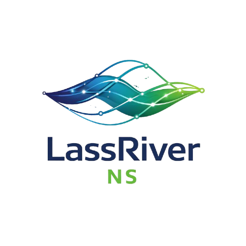

# LassRiver NS - Biblioteca Digital Premium



## 📚 Descripción

LassRiver NS es una plataforma premium de biblioteca digital diseñada para gestionar libros, préstamos, reseñas y usuarios con diferentes niveles de acceso. La aplicación combina una experiencia visual moderna inspirada en el flujo del conocimiento como un río digital, con funcionalidad robusta y accesible.

## ✨ Características Principales

### Para Usuarios
- 📖 **Catálogo Completo**: Exploración de libros con filtros avanzados por categoría, idioma, rating y disponibilidad
- ⭐ **Sistema de Reseñas**: Calificación y comentarios de 1-5 estrellas con validación de 500 caracteres
- ❤️ **Favoritos**: Gestión de libros favoritos con sincronización en tiempo real
- 👤 **Perfil Personalizado**: Edición de información personal y visualización de actividad

### Para Bibliotecarios
- 📊 **Gestión de Préstamos**: Control de préstamos activos, vencidos y devueltos
- 🔍 **Moderación de Reseñas**: Sistema de flagging y moderación de contenido
- 📈 **Estadísticas**: Métricas de uso y actividad de la biblioteca

### Para Administradores
- 📚 **Gestión de Libros**: CRUD completo de libros con validaciones
- 👥 **Control de Usuarios**: Administración de roles y permisos
- 🎯 **Dashboard Completo**: Métricas en tiempo real de toda la plataforma
- 📋 **Historial de Operaciones**: Auditoría de cambios y acciones

## 🎨 Design System

La identidad visual de LassRiver NS se basa en tres pilares:

- **Azul Profundo (#182858, #183868)**: Confianza, conocimiento
- **Cyan Tecnológico (#1898A8, #1888A8)**: Innovación, fluidez
- **Verde Natural (#68B848, #78B848)**: Crecimiento, aprendizaje

Ver documentación completa en [DESIGN_SYSTEM.md](DESIGN_SYSTEM.md)

## 🚀 Stack Tecnológico

- **Framework**: React 18.3.1 + TypeScript
- **Styling**: Tailwind CSS 4.0
- **UI Components**: Radix UI Primitives
- **Icons**: Lucide React
- **State Management**: React Context API
- **Notifications**: Sonner
- **Forms**: React Hook Form (ready to integrate)

## 📁 Estructura del Proyecto

```
src/
├── app/
│   ├── components/
│   │   ├── layout/          # Sidebar, Topbar
│   │   ├── shared/          # EmptyState, LoadingSkeleton, RatingStars, Badges
│   │   ├── ui/              # Componentes base (Radix UI)
│   │   └── views/           # Páginas principales
│   ├── context/             # AppContext para state management
│   ├── data/                # mockData.ts (a reemplazar con API)
│   └── lib/                 # Utilidades
├── imports/                 # Assets importados (logos, etc)
└── styles/                  # theme.css, fonts.css
```

## 🔐 Roles y Permisos

### Usuario (user)
- Ver catálogo público
- Gestionar favoritos
- Escribir y editar reseñas propias
- Ver y editar perfil

### Bibliotecario (librarian)
- Todo lo anterior
- Gestionar préstamos
- Moderar reseñas
- Ver dashboard de métricas

### Administrador (admin)
- Todo lo anterior
- Crear/editar/eliminar libros
- Gestionar usuarios (futuro)
- Acceso completo al sistema

## 🛣️ Rutas de la Aplicación

### Públicas
- `/` - Home/Landing page
- `/login` - Inicio de sesión
- `/register` - Registro de usuarios
- `/catalog` - Catálogo de libros

### Protegidas (Autenticación requerida)
- `/favorites` - Libros favoritos del usuario
- `/reviews` - Reseñas del usuario
- `/profile` - Perfil y configuración
- `/book-detail` - Detalle de libro seleccionado

### Administrativas (Admin/Librarian)
- `/admin` - Dashboard principal
  - Tab: Dashboard - Métricas generales
  - Tab: Books - Gestión de libros
  - Tab: Loans - Gestión de préstamos
  - Tab: Reviews - Moderación de reseñas

## 🔧 Instalación y Desarrollo

```bash
# Instalar dependencias
pnpm install

# Variables de entorno (crear .env)
VITE_API_BASE_URL=https://api.lassriver.com

# Modo desarrollo (ya corriendo en Figma Make)
npm run dev

# Build para producción
npm run build
```

## 📡 Integración con Backend

La aplicación actualmente usa datos mock en `src/app/data/mockData.ts`. Para integrar con backend:

1. Ver guía completa en [API_INTEGRATION.md](API_INTEGRATION.md)
2. Ver endpoints documentados en [HANDOFF.md](HANDOFF.md)
3. Implementar servicios en `src/app/services/`
4. Opcional: Usar React Query para cache y sincronización

### Endpoints Principales

```
POST   /api/auth/login
POST   /api/auth/register
GET    /api/books?search=&category=&language=
GET    /api/books/:id
POST   /api/favorites/:bookId
GET    /api/reviews
POST   /api/books/:bookId/reviews
```

Ver lista completa en [HANDOFF.md](HANDOFF.md)

## 🎯 Usuarios de Prueba

```javascript
// Usuario regular
Email: daniel.lasso@lassriver.com
Password: (cualquiera en modo mock)

// Bibliotecaria
Email: ana.rivera@lassriver.com
Password: (cualquiera en modo mock)

// Administrador
Email: admin@lassriver.com
Password: (cualquiera en modo mock)
```

## 🧩 Componentes Principales

### Shared Components

```tsx
// Empty States
<EmptyState
  icon={Heart}
  title="No tienes favoritos"
  description="Explora el catálogo..."
  actionLabel="Ir al Catálogo"
  onAction={() => navigate('/catalog')}
/>

// Rating Stars (Interactive/Readonly)
<RatingStars
  rating={4.5}
  onRatingChange={setRating}
  size="md"
  showLabel
/>

// Status Badges
<StatusBadge status="available" />
<StatusBadge status="overdue" />
<RoleBadge role="admin" />

// Loading Skeletons
<BookGridSkeleton count={8} />
<BookDetailSkeleton />
<TableSkeleton rows={5} />
```

## 📊 Data Models

```typescript
interface Book {
  id: string;
  title: string;
  author: string;
  isbn: string;
  category: string;
  language: string;
  publisher: string;
  publishDate: string;
  pages: number;
  description: string;
  coverUrl: string;
  rating: number;
  available: boolean;
  reviewCount: number;
}

interface User {
  id: string;
  name: string;
  email: string;
  role: "user" | "librarian" | "admin";
}

interface Review {
  id: string;
  bookId: string;
  userId: string;
  userName: string;
  rating: number;
  comment: string;
  date: string;
  flagged: boolean;
  flagReason?: string;
}

interface Loan {
  id: string;
  bookId: string;
  bookTitle: string;
  userId: string;
  userName: string;
  loanDate: string;
  dueDate: string;
  returnDate?: string;
  status: "active" | "overdue" | "returned";
}
```

## ♿ Accesibilidad

- ✅ Contraste WCAG AA en todos los textos
- ✅ Focus states visibles (ring de 3px)
- ✅ Labels en todos los inputs
- ✅ Alt text en imágenes
- ✅ Navegación por teclado
- ✅ Screen reader friendly

## 🎨 Patrones Visuales

### Patrón de Ondas
Inspirado en el logo LassRiver NS, usado en:
- Fondos de Login/Register (opacidad 5%)
- Hero section en Home (opacidad 10%)

### Glassmorphism Sutil
Aplicado en modales y elementos destacados para dar sensación de profundidad y modernidad.

### Animaciones
- Transiciones suaves (200-300ms)
- Hover effects en cards (translateY -2px)
- Skeleton pulse animation
- Toast notifications slide-in

## 📝 Próximos Pasos

### Fase 1: Backend Integration
- [ ] Implementar servicios de API
- [ ] Conectar autenticación JWT
- [ ] Migrar de mockData a endpoints reales
- [ ] Agregar error handling global

### Fase 2: Features
- [ ] Paginación en catálogo
- [ ] Búsqueda avanzada
- [ ] Exportar reportes (Admin)
- [ ] Notificaciones push
- [ ] Modo offline

### Fase 3: Optimization
- [ ] React Query para cache
- [ ] Lazy loading de rutas
- [ ] Image optimization
- [ ] Performance monitoring

### Fase 4: Testing
- [ ] Unit tests (Vitest)
- [ ] Integration tests
- [ ] E2E tests (Playwright)
- [ ] Accessibility tests

## 📚 Documentación

- [HANDOFF.md](HANDOFF.md) - Guía completa de handoff a desarrollo
- [DESIGN_SYSTEM.md](DESIGN_SYSTEM.md) - Sistema de diseño completo
- [API_INTEGRATION.md](API_INTEGRATION.md) - Guía de integración con backend

## 🤝 Contribución

Este proyecto está preparado para handoff a desarrollo frontend. Para contribuir:

1. Leer documentación de handoff
2. Seguir convenciones del design system
3. Mantener consistencia visual
4. Agregar tests para nuevas features
5. Documentar cambios importantes

## 📄 Licencia

Proyecto propietario de LassRiver NS.

---

**Desarrollado con ❤️ para LassRiver NS**

*Biblioteca Digital Premium - Donde el conocimiento fluye como un río*
