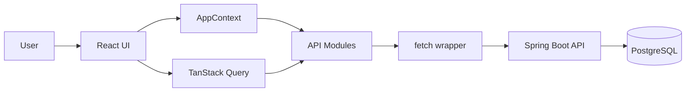

# BookWorm Frontend


BookWorm Frontend is the React client for a digital library platform. It provides the user interface for authentication, book discovery, favorites, loans, reservations, reviews, notifications, administration, in-app PDF reading, and an AI reading assistant.

The application is built with React, Vite, TypeScript, TanStack Query, Tailwind CSS, Radix UI primitives, Chart.js, and a custom fetch-based API layer.

The visual badges above are generated remotely by Shields.io, so this README stays polished without requiring screenshots or checked-in image assets.

## Table Of Contents

- [Product Scope](#product-scope)
- [Architecture Overview](#architecture-overview)
- [Core Features](#core-features)
- [Technology Stack](#technology-stack)
- [Project Structure](#project-structure)
- [Runtime Configuration](#runtime-configuration)
- [Local Development](#local-development)
- [Application State](#application-state)
- [API Integration](#api-integration)
- [Main Screens](#main-screens)
- [Documentation](#documentation)
- [Quality Checklist](#quality-checklist)

## Product Scope

BookWorm is designed as a transactional library application, not just a static catalog. The frontend coordinates workflows that affect several backend resources at once:

- Borrowing a book updates copy availability, loans, notifications, and the selected book view.
- Returning a book can fulfill the next reservation in the queue.
- Reserving a book updates queue state and user notifications.
- Moderating a review changes visible ratings and review counts.
- Managing copies changes catalog availability.

The frontend keeps those workflows understandable by centralizing cross-screen actions in `AppContext` and delegating server-state caching to TanStack Query.

## Architecture Overview



The frontend has three main state layers:

| Layer | Responsibility | Examples |
|---|---|---|
| Local component state | Temporary UI state | Form inputs, dialogs, selected PDF page, chat input |
| `AppContext` | Shared client state and workflows | Current user, selected book, current view, filters, actions |
| TanStack Query | Remote server state | Books, loans, reservations, favorites, notifications, reviews |

## Core Features

### Reader Users

- Register and sign in with JWT-backed authentication.
- Browse the catalog with search, category, language, availability, and pagination controls.
- Mark books as favorites.
- Borrow available books with a duration between 5 minutes and 7 days.
- Join a reservation queue when no copies are available.
- View current, overdue, and returned loans.
- Renew eligible loans.
- Filter loans by date.
- Read borrowed PDFs inside the app.
- Ask the AI assistant questions about a book or selected text.
- Write reviews for books previously borrowed.
- View persistent notifications.

### Librarians And Administrators

- Access the administration panel.
- View operational dashboard charts.
- Create, edit, activate, inactivate, and delete books.
- Upload PDF files or attach PDFs from allowed remote URLs.
- Add and retire book copies.
- Review active and overdue loans.
- Mark loans as returned.
- Moderate reviews by hiding or showing them.

## Technology Stack

| Area | Technology |
|---|---|
| Framework | React 18 |
| Build tool | Vite |
| Language | TypeScript |
| Server-state cache | TanStack Query |
| Styling | Tailwind CSS |
| UI primitives | Radix UI |
| Icons | Lucide React |
| Charts | Chart.js and React Chart.js 2 |
| Toasts | Sonner |
| Markdown rendering | React Markdown and remark-gfm |
| API transport | Browser `fetch` through a local wrapper |

## Project Structure

```text
src/
  api/
    auth.ts
    books.ts
    chat.ts
    favorites.ts
    http.ts
    loans.ts
    mappers.ts
    notifications.ts
    reservations.ts
    reviews.ts
    users.ts
  components/
    book-detail/
    catalog/
    chat/
    loans/
    notifications/
    reviews/
    ui/
  context/
    AppContext.tsx
  hooks/
    queryKeys.ts
    use-mobile.ts
    useLibraryQueries.ts
  layouts/
    Sidebar.tsx
    Topbar.tsx
  lib/
    queryClient.ts
  pages/
    AdminPage.tsx
    BookDetailPage.tsx
    BookReaderPage.tsx
    CatalogPage.tsx
    FavoritesPage.tsx
    HomePage.tsx
    LoansPage.tsx
    LoginPage.tsx
    ProfilePage.tsx
    RegisterPage.tsx
    ReservationsPage.tsx
    ReviewsPage.tsx
  utils/
    display.ts
    validation.ts
```

## Runtime Configuration

The frontend reads the backend base URL from:

```text
VITE_API_BASE_URL
```

If the variable is not defined, the application uses:

```text
/api
```

Recommended local `.env`:

```env
VITE_API_BASE_URL=http://localhost:8080/api
```

If the frontend is served behind a reverse proxy that forwards `/api` to the backend, the variable can be omitted.

## Local Development

Install dependencies:

```bash
npm install
```

Start the development server:

```bash
npm run dev
```

Build for production:

```bash
npm run build
```

Run linting:

```bash
npm run lint
```

The default Vite development URL is usually:

```text
http://localhost:5173
```

## Application State

### `AppContext`

`src/context/AppContext.tsx` is the frontend workflow coordinator. It stores the authenticated user, current view, selected book, catalog filters, sidebar state, theme, and high-level actions.

Important actions include:

- `login`
- `register`
- `logout`
- `toggleFavorite`
- `addLoan`
- `updateLoan`
- `renewLoan`
- `createReservation`
- `cancelReservation`
- `addReview`
- `hideReview`
- `keepReviewVisible`
- `addBook`
- `updateBook`
- `deleteBook`
- `createBookCopy`
- `deleteBookCopy`
- `uploadBookPdf`
- `downloadBookPdf`

### TanStack Query

`src/hooks/useLibraryQueries.ts` defines query hooks for:

- Books.
- Book facets.
- Favorites.
- Loans.
- Reservations.
- Notifications.
- Admin reviews.

`src/hooks/queryKeys.ts` centralizes query keys so invalidations are consistent.

### API Mappers

`src/api/mappers.ts` converts backend DTOs into frontend view models. This keeps UI components independent from backend naming and enum formats.

## API Integration

The custom HTTP layer is located at:

```text
src/api/http.ts
```

It handles:

- API URL construction.
- JSON serialization.
- JWT headers.
- Error normalization.
- Session cleanup on `401`.

The chat API is intentionally separate because it consumes a streaming response:

```text
src/api/chat.ts
```

## Main Screens

| Screen | Component | Responsibility |
|---|---|---|
| Home | `HomePage` | Overview, quick navigation, featured books |
| Catalog | `CatalogPage` | Search, filters, pagination, book cards |
| Book detail | `BookDetailPage` | Borrow, reserve, review, favorite, open reader |
| Reader | `BookReaderPage` | PDF rendering, page navigation, AI chat |
| Favorites | `FavoritesPage` | User favorite books |
| Loans | `LoansPage` | Loan list, date filters, returns, renewals |
| Reservations | `ReservationsPage` | Reservation queue status and cancellation |
| Reviews | `ReviewsPage` | User reviews |
| Profile | `ProfilePage` | Profile editing and password change |
| Admin | `AdminPage` | Dashboard, books, copies, loans, review moderation |

## Documentation

The project includes bilingual technical documentation:

```text
docs/
  en/
    architecture_and_flow.md
    backend_api.md
    frontend_architecture.md
  es/
    architecture_and_flow.md
    backend_api.md
    frontend_architecture.md
```

Recommended entry points:

- [Architecture And Flow](docs/en/architecture_and_flow.md)
- [Backend API Contract](docs/en/backend_api.md)
- [Frontend Architecture](docs/en/frontend_architecture.md)

## Quality Checklist

Before opening a pull request:

- Run `npm run lint`.
- Run `npm run build`.
- Verify authenticated and unauthenticated flows.
- Verify catalog filters after changing book or query logic.
- Verify loan, reservation, notification, and favorite query invalidations.
- Keep new shared UI behavior in reusable components when it appears in more than one screen.
